<h1 align="center">👋 I'm Yang</h1>
<h3 align="center">Statistics student living in the USA</h3>

  Learning and curious about <strong>Python, R, C++, Machine Learning & Statistics</strong>
   
  Writing <a href="https://www.kenwuyang.com/posts">here</a> to keep learning, one post at a time

  
  

<h3 align="center">Stack</h3>

  

<h3 align="center">Top Languages</h3>

  

